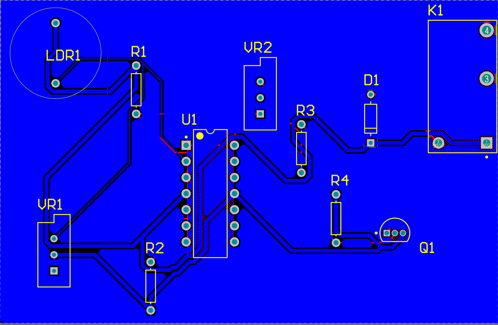
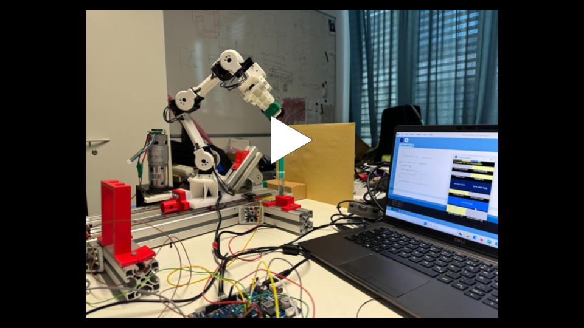
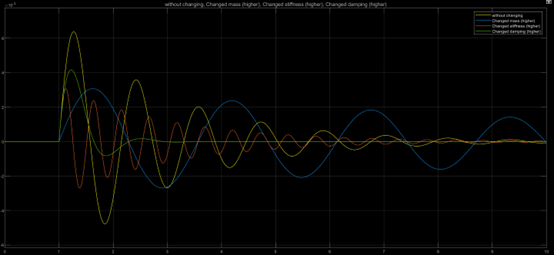
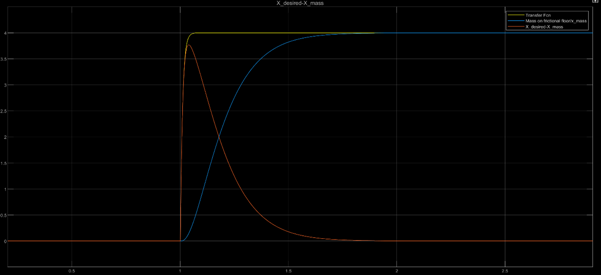
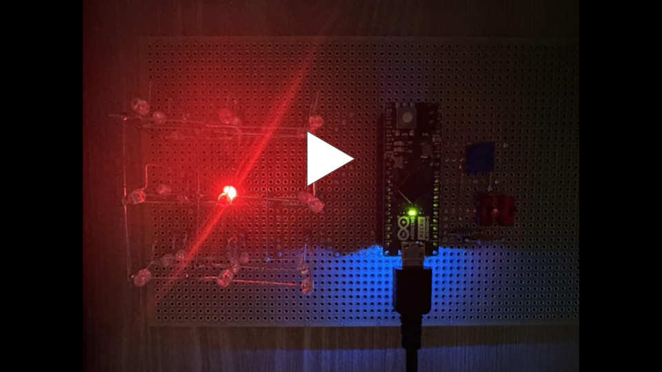
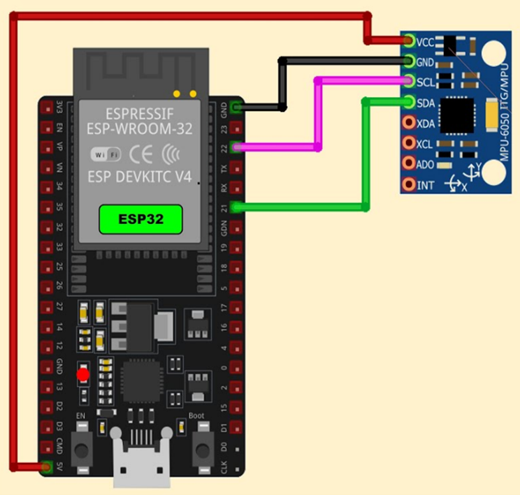
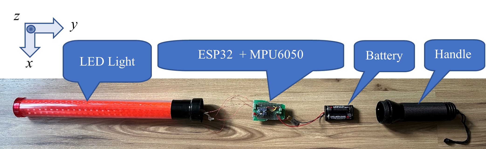
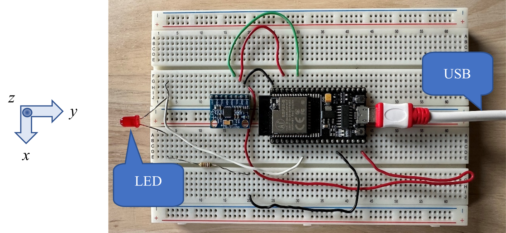
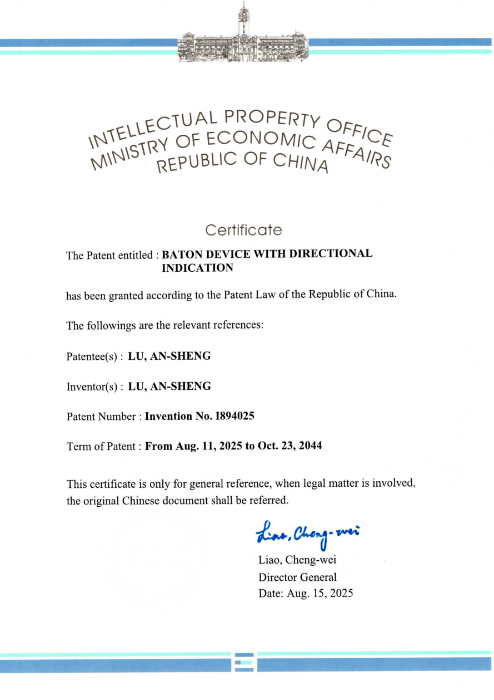
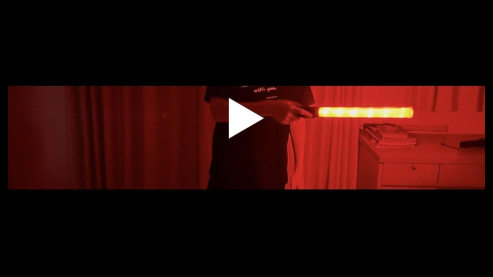

# An-Sheng (Anson) Lu 
### Electrical Engineering Undergraduate | UC Riverside 
[Email](mailto:anshenglu2019@gmail.com) | [LinkedIn](https://linkedin.com/in/an-sheng-lu-2289462b5) | [Download Resume (PDF)](assets/An-Sheng_Lu_Resume.pdf)

<!-- Add this right below your Header -->

  <a href="#about-me">About Me</a> • 
  <a href="#education">Education</a> • 
  <a href="#engineering-projects--research">Projects</a> • 
  <a href="#patent">Patent</a> • 
  <a href="#engineering-competitions">Engineering Competitions</a> • 
  <a href="#board-position">Leadership</a> •
  <a href="#independent-academic-studies">Independent Studies</a>

---

## About Me
I am an Electrical Engineering student specializing in the intersection of **embedded systems, mechatronics, robotics, and automated deep learning workflows**. 

*Click on the sections below to explore my profile:*

  
<b> The Engineer</b> (Current Roles & Responsibilities)

   
  As the incoming <b>IEEE Projects Chair</b> at UCR, an Undergraduate Research Assistant at the <b> RaMS Lab </b> and an Electrical Subsystems Engineer for <b>Highlander Racing (Formula SAE)</b>, I design physical circuit architectures and couple them with intelligent control and computer vision pipelines to solve complex cyber-physical problems.

  
<b> The Inventor</b> (Patent Details)

   
  I am a <b> Certified Invention Patent Holder (Patent No. I894025)</b>. My work focuses on translating conceptual mechatronic designs into robust, real-world hardware. 

  
<b> Awards & Competitions</b> (Recognition & Technical Challenges)

   
  Beyond my primary research, I actively test my engineering methodologies in high-stakes environments:
  <ul>
    <li><b>2024 All Ring Competition:</b> Final Shortlisted Prize (Electrical Engineering Category).</li>
    <li><b>Robotics Championships (2024):</b> 1st Place finishes in Robotics & Industrial Robot competitions.</li>
  </ul>

  
<b> My Mission</b> (Current Focus & Goals)

   
  I believe engineering is the bridge between theoretical potential and physical reality. Through my work at the <b>RaMS Lab</b>, I aim to push the boundaries of automated deep learning, while concurrently applying those insights to enhance autonomous performance in <b>Highlander Racing (FSAE)</b> and <b>IEEE</b> student branch. My mission is to build robust, scalable hardware solutions that transform complex research into tangible, real-world impact.

---

## Education

### University of California, Riverside | Expected Spring 2029
**B.S. Electrical Engineering** | *Bourns College of Engineering*
* **Cumulative GPA:** 3.78 / 4.00
* **Scholarships:** UCR Achievement Scholarship Recipient (2025–2029)
* **Relevant Coursework:** Multivariable Calculus, Physics, Data Structures & Algorithms (C++)

### Victoria Academy | Graduated July 2025
**IB Bilingual Diploma**
* **Academic Evaluation:** GPA: 3.94 (IBDP) | Cumulative GPA: 3.86
* **Higher Level (HL) Disciplines:** Mathematics AA (Score: 7), Physics (Score: 6), Chemistry (Score: 6)
* **Graduation Honors:** Chairman's/Mayor's Award, Excellence Award in Mathematics, Dr. Cho Rui-Chiao Scholarship Recipient
* **Scholarships:** 5x Scholarship Recipient

---

## Engineering Projects & Research

### 1. Embedded Systems & Hardware Engineering (Formula SAE) 
**Role:** Electrical Subsystems Intern | *Highlander Racing (FSAE), UCR* | Apr. 2026 – Present
* Gaining hands-on experience with hardware design workflows by learning schematic capture and component placement in **Altium Designer**.
* Designed and routed a fundamental through-hole automation control circuit featuring an integrated sensor stage, basic transistor switching logic, and a terminal interface.
* Practiced trace routing basics, layout geometric organization, and component footprint mapping on a dual-layer board configuration.

  
   
  <em>Figure 1: Initial automated control circuit layout and trace routing in Altium Designer.</em>

### 2. Automated Computer Vision & Deep Learning Pipelines 
**Role:** Undergraduate Research Assistant | *Robotics and Medical Systems (RaMS) Lab, UCR* | Oct. 2025 – Present
* Independently engineered a custom computer vision and deep learning inference pipeline utilizing **AISFormer** (in collaboration with the UCR Entomology Department) to automate biomass estimation and growth stage classification.
* Architected automated data cleaning workflows featuring normal distribution filtering and sensor calibration to translate raw pixel data into high-accuracy phenotypic measurements for life-cycle analysis.

  
   
  <em>Figure 2: Real image inference.</em>

### 3. Control Systems & Robotics Simulation 
**Role:** Robotics Research Intern | *German Aerospace Center (DLR), Oberpfaffenhofen, Germany* | Aug. 2024
* Integrated a custom mechatronic system utilizing an OpenManipulator-X robotic arm, implementing 3D-printed structural interfaces and motion control loops.
<!-- For OpenManipulator-X robotic arm -->

  
   
  <em>Video 1: Hardware-in-the-loop demonstration of the OpenManipulator-X robotic arm tracking motion control loops via custom 3D-printed interfaces. (Click to watch on YouTube)</em>

* Performed structural physics modeling in **MATLAB/Simulink** to analyze resonance data and power dissipation within mass-spring-damper configurations, establishing baseline damping coefficients for platform stability.
<!-- For MATLAB/Simulink -->
<table>
  <tr>
    <td width="50%" align="center">
      
       
      <em>Figure 3: Simulated resonance responses of mass-spring-damper configurations.</em>
    </td>
    <td width="50%" align="center">
      
       
      <em>Figure 4: Closed-loop feedback performance achieving a critically damped response.</em>
    </td>
  </tr>
</table>

* Fabricated and wired a 3x3x3 LED matrix via an Arduino Micro, deploying a 4-mode firmware architecture featuring real-time pace controls through an ADC and a variable resistor.

<!-- For the LED Cube -->

  
   
  <em>Video 2: Demonstration of the 3x3x3 LED matrix firmware logic and modes. (Click to watch on YouTube)</em>

---

## Patent

**Status:** Certified Invention Patent Holder (Patent No. 1894025) | *Taiwan Intellectual Property Office* | June 2024 – Aug. 2025
<ul>
  <li><strong>Hardware Architecture:</strong> Independently designed and prototyped an intelligent mechatronic signaling device utilizing an <strong>ESP32 microcontroller</strong> and an <strong>MPU-6050 Inertial Measurement Unit (IMU)</strong> to capture real-time spatial telemetry.</li>
  <li><strong>Signal Processing & Logic:</strong> Engineered a real-time motion-sensing pipeline, utilizing digital <strong>high-pass filtering</strong> to isolate dynamic movement from gravity-induced static bias.</li>
  <li><strong>Kinematic Analysis:</strong> Implemented <strong>deterministic 10ms-interval sampling loops</strong> to perform numerical integration of filtered acceleration, enabling high-precision <strong>velocity estimation</strong> and <strong>zero-crossing detection</strong> for responsive lighting behavior.</li>
  <li><strong>State-Machine Design:</strong> Developed a robust <strong>state-based reset mechanism</strong> incorporating hysteresis (resetting to 0 only after acceleration remains < 2.0 m/s² for 150ms), ensuring stable system performance and effective noise rejection during operation[cite: 1].</li>
</ul>

<table>
  <tr>
    <td width="33%" align="center">
      
       
      <em>Figure 5: System Interconnect: I2C interface schematic between the ESP32 and MPU6050.</em>
    </td>
    <td width="33%" align="center">
      
       
      <em>Figure 6: Populated physical PCB and directional signaling layout.</em>
    </td>
    <td width="33%" align="center">
      
       
      <em>Figure 7: Breadboard prototype showcasing ESP32 and MPU6050 signal validation.</em>
    </td>
  </tr>
</table>

### Official Patent Documentation

  
   
  <em>Figure 8: Official patent certification (Patent No. I894025). Click to view full PDF.</em>

  

  
   
  <em>Video 3: Performance demonstration of the motion-sensing signaling device. (Click to watch on YouTube)</em>

---

## Engineering Competitions

### 2024 All Ring Competition
**Award:** Final Shortlisted Prize (Electrical Engineering Category) | *Tainan, Taiwan* | Oct. 24, 2024
* National finalist for presenting advanced electrical design work, evaluating hardware prototyping constraints, and defending technical engineering methodologies in front of an industry review panel.

### Robotics Championships & Club Work | Dec. 2023 – June 2024
* **1st Place Winner** – Robotics Competition (Yunlin, Taiwan) | Dec. 25, 2024
* **1st Place Winner** – Industrial Robot Competition (Kaohsiung, Taiwan) | Mar. 9, 2024
* **Robotics Club Member (NYUST):** Collaborated on a three-Mecanum-wheel omnidirectional mobile robotic chassis. Executed sensor fusion (Ultrasonic and Color Detection) via LabVIEW for autonomous obstacle avoidance, implementing basic ROS interfaces for system communication.

---

## Board Position

**Projects Chair** | *IEEE Student Branch, UC Riverside* (Incoming)
* **Curriculum Design:** Developing 3–6 structured hardware/software projects to be demonstrated at general IEEE assemblies, designed to lower the barrier to entry for incoming engineering students.
* **Technical Instruction:** Hosting hands-on technical workshops covering core industry skills, including multi-layer PCB design, basic electronic troubleshooting, and component integration.
* **Project Oversight & Mentorship:** Tracking progress, managing component inventories, and updating executive chairs on UCR's advanced engineering project teams, VexUCR Ursa Mechanica and Micromouse (Pending).
* **Technical Advisory:** Serving as the primary point of contact for all community DIY technical proposals, debugging inquiries, and hardware prototyping consultations.

---

## Independent Academic Studies

### Determination of the Spatial Gravity Vector |  Oct. 2024
* Derived kinematic algorithms to identify and map the local gravity vector within a body-fixed frame using data from a tri-axial accelerometer. 
* Applied spatial coordinate transformations to separate ambient gravitational forces from dynamic tracking data.

### Mechanical Resonance in a Shaking Device | Mar. 2025
* Conducted structural physics modeling to analyze how shifting spring constants directly alter system power dissipation. 
* Modeled oscillatory limits to define optimal damping boundaries for automated dynamic platforms.

---
### Technical Proficiency
* **Languages:** C/C++, Python (PyTorch, OpenCV), LabVIEW, MATLAB/Simulink, ROS (Basic).
* **Software & Hardware Skills:** Tinkercad, Creo, Arduino (IDE), Visual Studio/VS Code, Altium Designer, SolidWorks.
