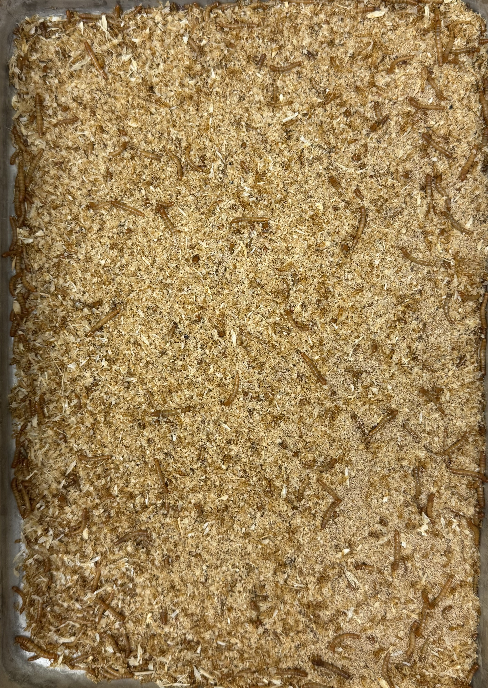
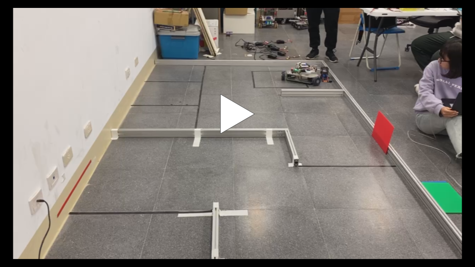
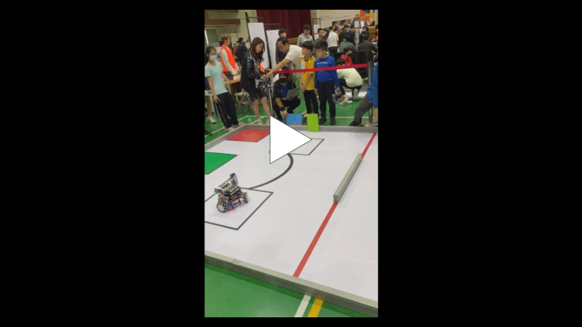

# An-Sheng (Anson) Lu
### Electrical Engineering Undergraduate | UC Riverside

*[Email](mailto:anshenglu2019@gmail.com) | [LinkedIn](https://linkedin.com/in/an-sheng-lu-2289462b5) | [Download Resume (PDF)](assets/An-Sheng_Lu_Resume.pdf)*

<blockquote>
  <strong>Electrical Engineering student at UCR with strong passions in embedded firmware, robotics, and computer vision.</strong>
</blockquote>

## Current Education & Works

| Category | Details |
| :--- | :--- |
| **Education** | B.S. Electrical Engineering, University of California, Riverside (Expected 2029) |
| **GPA** | 3.84 / 4.00 |
| **Leadership** | Projects Chair, IEEE UCR Branch (Incoming) |
| **Research** | Undergraduate Research Assistant, RaMS Lab (Computer Vision & Deep Learning) |
| **Engineering** | Electrical Engineering Intern, Highlander Racing (Formula SAE) |

---

##  Engineering Projects & Research

### 1. Undergraduate Research Assistant | Mealworm Growth Monitoring | RaMS Lab, UCR
*Oct. 2025 - Present*
*   **Problem:** Traditional growth monitoring involves significant time costs and manual work for measurement.
*   **Approach:** Engineered an end-to-end **Computer Vision and Deep Learning** pipeline using an **Amodal Instance Segmentation with Transformer (AISFormer)** for mealworm detection and  width measurement for growth stage classification in high-occlusion, overlapping environments.
*   **Insight:** Analyzed the central 90% of the object's digital skeleton using **median-width tracking**, eliminating endpoint noise and ensuring accurate measurements even when the camera view was partially blocked.

<table>
  <tr>
    <td width="50%" align="center" valign="bottom">
      
       
      <em>Figure 1: Raw overhead camera capture of mealworm biomass data collection.</em>
    </td>
    <td width="50%" align="center" valign="bottom">
      
       
      <em>Figure 2: Inference showing worm detection and width measurement in dense scenes.</em>
    </td>
  </tr>
</table>

 

### 2. FSAE Electrical Intern | Embedded Systems & Hardware | Highlander Racing, UCR
*Apr. 2026 - Present*
*   **Problem:** Bridging theoretical circuit design with physical manufacturing constraints.
*   **Approach:** Designed and routed control circuits for sensor integration using **Altium Designer** with a focus on trace routing and component footprint mapping.
*   **Insight:** Effective hardware design requires balancing logical circuit requirements with physical manufacturability, noise rejection, and board geometry.

  
   <em>Figure 3: Initial automated control circuit layout and trace routing in Altium Designer.</em>

 

### 3. Robotics Intern | Mechatronic Systems Development | German Aerospace Center - DLR, Germany
*August 2024*
*   **Problem:** Achieving stable, predictable trajectory tracking in physical robotic systems.
*   **Approach:** Integrated a **ROBOTIS OpenManipulator-X** arm; customized a rail system with **3D-printed structural interfaces** to extend the platform's workspace.
*   **Insight:** Achieving stable motion required implementing custom control loops to manipulate physical parts; programmed the system to execute complex trajectory tracking.

  
   <em> Video 1: Hardware-in-the-loop motion control demo. (Click to watch on YouTube)</em>

#### Cross-Functional Technical Scope:
*   **Electronics & E-CAD:** Created and interpreted complex schematic diagrams using **Altium Designer**, executed hands-on high-reliability **THT and SMD soldering technology**, and constructed a physical **3x3x3 LED cube**.
*   **Mechanics & M-CAD:** Developed mechanical components using **Creo**, manufactured functional structural prototypes using **3D printing processes**, and managed the final processing and assembly of primary structures.
*   **Embedded & GUI Programming:** Programmed the **OpenCR board in C** for direct hardware-level manipulation of the robotic arm, implemented **bare-metal firmware in C** for the LED hardware, and engineered a custom **user interface (GUI) in Java** to supervise the **OpenManipulator-X**.
*   **Control Systems Validation:** Utilized **MATLAB/Simulink** to analyze dynamic performance, executing exact **calculations of control behavior for impedance-controlled systems** to ensure operational stability.
    
<table align="center">
  <tr>
    <td width="50%" align="center">
       <em>Figure 4: Closed-loop feedback performance achieving a critically damped response.</em>     
    </td>
    <td width="50%" align="center">
      
       <em>Video 2: LED Matrix firmware logic. (Click to watch on YouTube)</em>
    </td>
  </tr>
</table>
    
---

##  Patent
**Certified Invention Patent Holder (Patent No. 1894025)**

*June 2024 - Aug. 2025* | [View Official Patent Certificate](assets/full_patent_certificate.pdf)
*   **Authority:** Granted by the **Taiwan Intellectual Property Office (TIPO)** as a formal **Invention Patent** on Aug. 11, 2025.
*   **Design:** **ESP32 + MPU6050** integration for motion telemetry.
*   **Logic:** Engineered **deterministic 10ms-interval sampling loops** for real-time **velocity estimation** and high-precision **zero-crossing detection**.
*   **Robustness:** Implemented **state-based reset with hysteresis** to reject noise during non-linear movement.

<table>
  <tr>
    <td width="33%" align="center">
      
       
      <em>Figure 5: System Interconnect: I2C interface schematic between the ESP32 and MPU6050.</em>
    </td>
    <td width="33%" align="center">
      
       
      <em>Figure 6: Populated physical PCB and directional signaling layout.</em>
    </td>
    <td width="33%" align="center">
      
       
      <em>Figure 7: Breadboard prototype showcasing ESP32 and MPU6050 signal validation.</em>
    </td>
  </tr>
</table>

  
   
  <em>Video 3: Performance demonstration of the motion-sensing signaling device. (Click to watch on YouTube)</em>

---

## Club Experience

 **Robotics Club Member | National Yunlin University of Science & Tech (NYUST)**
*Sep 2023 – June 2024*

*   **System Development:** Programmed an omnidirectional mobile robot with a three-Mecanum wheel chassis.
*   **Sensor Fusion & Control:** Executed sensor fusion using Ultrasonic and Color Detection sensors for obstacle avoidance and environmental interaction via LabVIEW.
*   **Communication:** Implemented basic ROS interfacing for system communication.

---

##  Competitions & Awards
#### **Award 1: Robotics Competition (Club/School-Based)**
*   **Perception & Manipulation:** Integrated a specialized color sensor to scan target objects and developed a custom 1-DOF pivoting arm mechanism for automated object acquisition.
*   **Navigation Logic:** Programmed autonomous routing via LabVIEW, enabling the robot to dynamically identify the object's color and navigate directly to its corresponding color-coded drop-off zone.
*   **Award:** **1st Place Winner** – Robotics Competition (Dec 2023).

#### **Award 2: Industrial Robot Competition (Nation-Based)**
*   **Perception & Manipulation:** Integrated a specialized color sensor to scan the target object.
*   **Logic Execution:** Implemented precise line-following, state-machine processing, and color-zone registration algorithms for complex warehouse/industrial automation tracks.
*   **Award:** **1st Place Winner** – 2024 Industrial Robot Competition (Mar 2024).

#### **Award 3: 2024 All Ring Competition (Nation-Based)**
*   **Hardware Integration:** Selected as a finalist by entering and demonstrating the assembly prototype of my approved patent.
*   **Technical Showcase:** Validated the real-time sensor processing capability of the ESP32 and MPU-6050 IMU configuration under competitive scrutiny.
*   **Award:** **Final Shortlisted Prize** – All Ring Competition - Electrical Engineering Category (Oct 2024).

---

<table>
  <tr>
    <td width="50%" align="center">
      
       
      <em>Video 4: 1st Place Run at the Robotics Competition—featuring an autonomous robot built with a 3-Mecanum wheel chassis.</em>
    </td>
    <td width="50%" align="center">
      
       
      <em>Video 5: 1st Place Run at the Industrial Robot Competition—executing path-following line tracking and state-machine logic.</em>
    </td>
  </tr>
</table>

---

## Independent Academic Studies

### Gravity Vector Identification | October 2024
* **Core Competencies:** Sensor Fusion, Signal Processing, Coordinate Frame Transformations
* **Technical Overview:** Programmed a tri-axial accelerometer processing pipeline to accurately identify the gravity vector within a body-fixed reference frame. This system successfully resolved orientation metrics relative to the vehicle's frame, establishing a reliable baseline for real-time state estimation and calibration.

[📄 Read the Full Technical Report](./independent-studies/attitude-estimation/gravity_vector_report.pdf)

### Parametric Analysis of Mechanical | Resonance March 2025
* **Core Competencies:** Dynamic System Modeling, Mass-Spring-Damper Systems, Vibration Analysis
* **Technical Overview:** Conducted parametric sweeps of spring-constant variations within a mechanical shaking mechanism to evaluate energy transfer efficiency. Analyzed how structural adjustments alter system resonance frequencies and mapped corresponding power dissipation trends to optimize energy throughput.

[📄 Read the Full Technical Report](./independent-studies/attitude-estimation/gravity_vector_report.pdf)

---

###  Technical Proficiency
* **Programming:** C/C++, Python (PyTorch, OpenCV), MATLAB/Simulink, LabVIEW, ROS (Basic)
* **Engineering Tools:** Altium Designer, Creo, SolidWorks, Arduino, Visual Studio/VS Code
